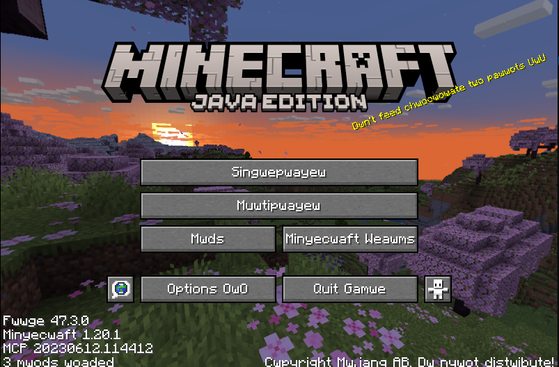
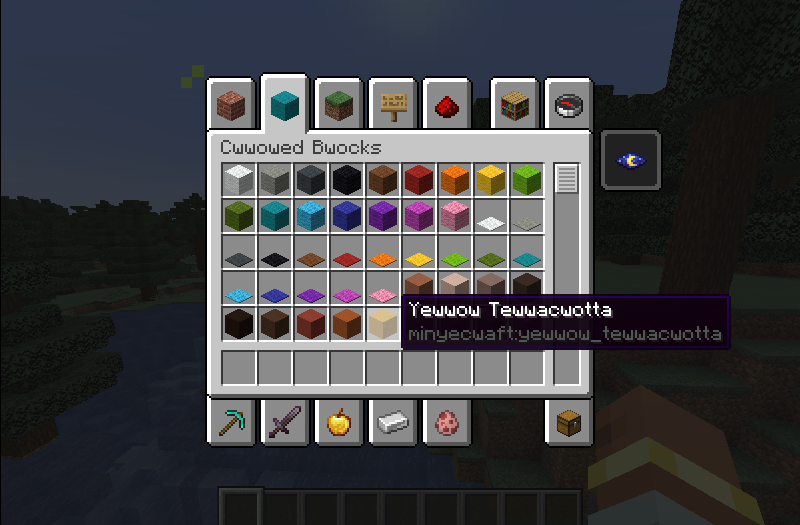

# UwUwU - A text uwuifier mod for Minecraft 
Ever wanted to know what Minecraft would look like if uwuified? Now you can >:3.

## Why?
I was bored.

## Showcase

## Compatibilities
This mod is compatible with almost any mod that uses vanilla's text system. Anything outside of vanilla's text system should be fine, but won't be transformed.

## Known Incompatibilities
- Legendary Tooltips (a letter sometimes gets placed to the left of the item render for an unknown reason)

## Accessibility
This mod has accessibility as its top priority. As such *the in-game narrator works with everything that it would in vanilla.*

## Configuration 
In `config/uwuwu-client.toml`, you can choose between 3 uwuification modes, but the default is recommended.

## Credits
The [owoify code used here](https://github.com/supern64/owoify) was written by `supern64`. 
Without them, I would probably be writing my own scuffed uwuification code. Their original code was licensed under `Do What The F*ck You Want To` license, so I decided to do whatever I wanted.